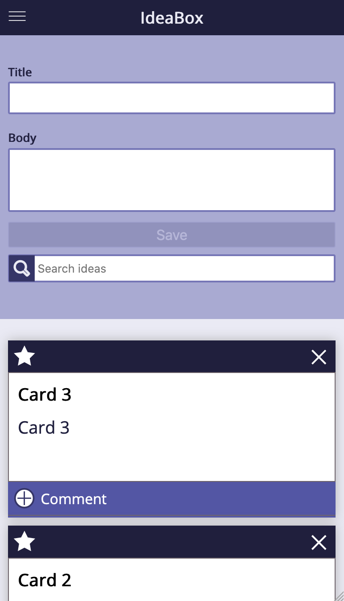
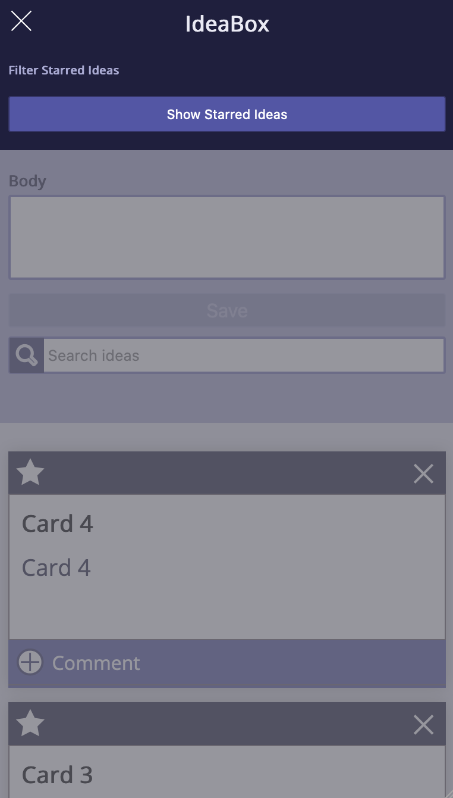
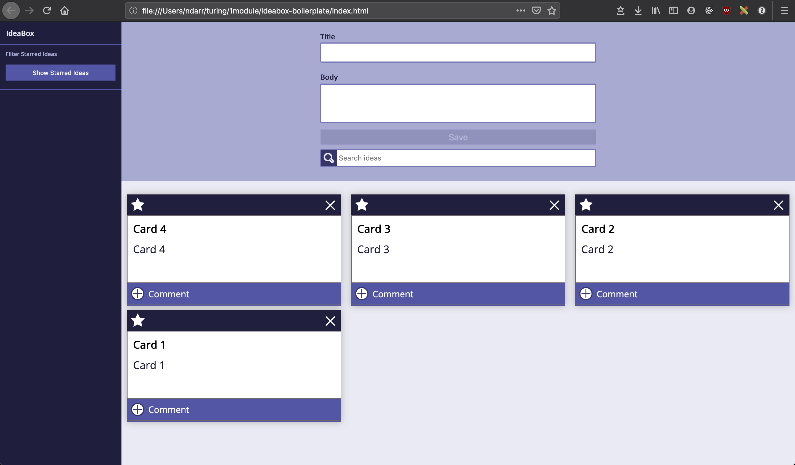
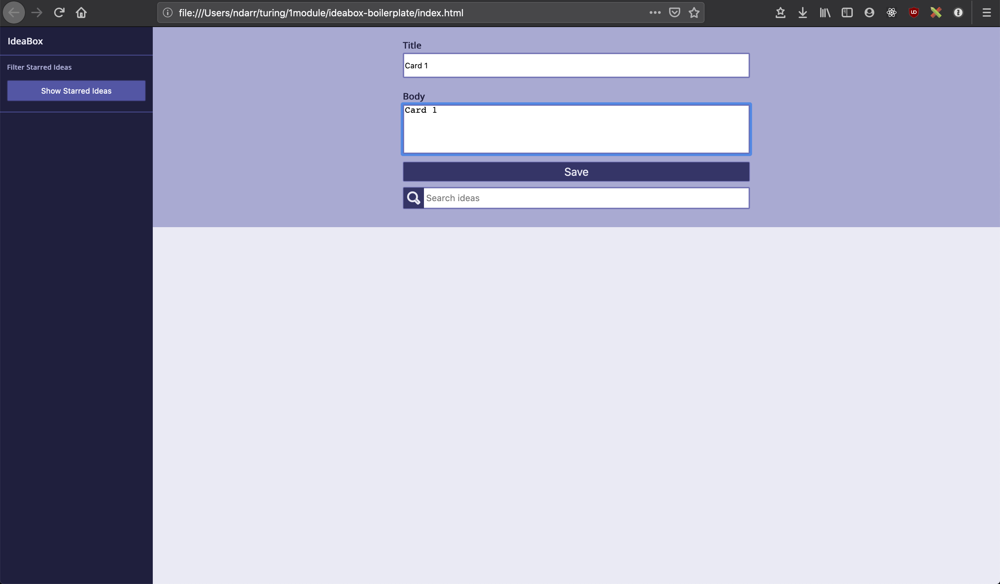
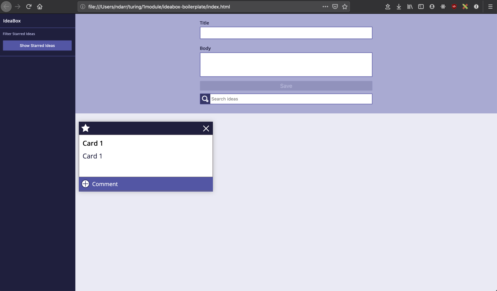
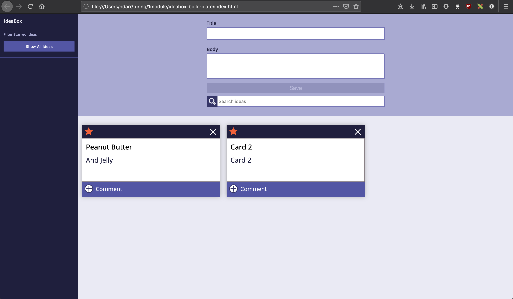
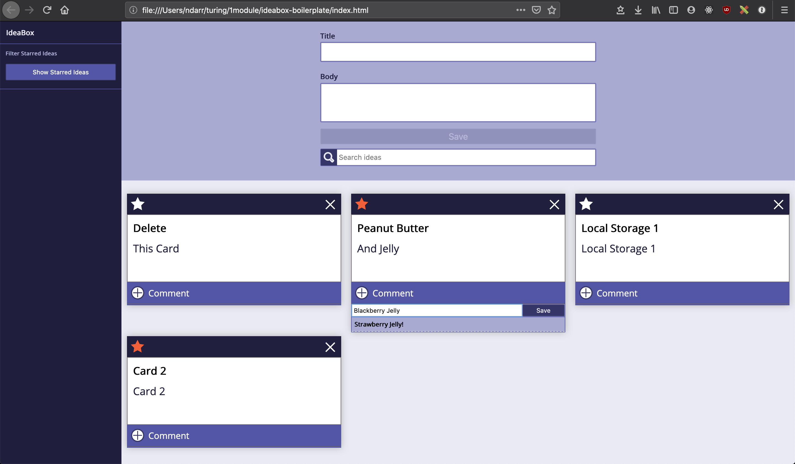
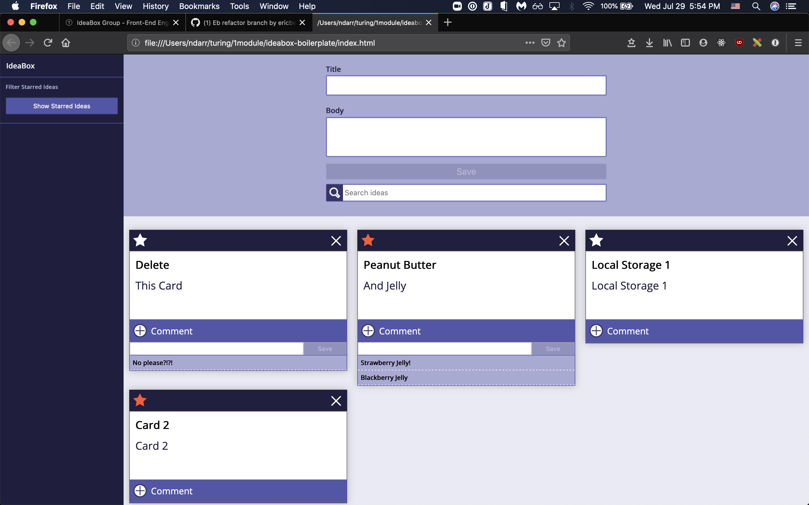

# IdeaBox Group Project

A Javascript project by Nathan Darrington, Nathaniel Millard, Eric Berglund.

## Introduction

This project entailed constructing idea cards that a user could create, save, favorite, comment and delete. The project allows the user to store their idea cards into local storage and on page refresh the data will not be lost unless they clear their local storage or exit the browser entirely. The project spanned approximately eight days.

## Progression

### Iteration 0 - Mobile View

Mobile View Normal

Mobile View Dropdown menu

### Iteration 1 - Desktop View

### Iteration 2 - Adding Ideas

### Iteration 3 - Favoriting And Deleting Ideas

### Iteration 4 - Filtering Posters and Local Storage

### Iteration 5 - Adding Comments

## Key Concepts and Challenges

1. Local Storage

The challenging part of local storage was deciding how to store the data. At first, we used each Idea's unique ID to store them individually. This made it a little more of a challenge when figuring out how to pull the unique idea out of local storage. After our local storage lesson, we changed to storing the entire list array and this made it easier to target exactly what we wanted pull out of local storage and re-populate the list array.

2. Filtering

The hard part of filtering was learning how to keep the functions concise without nesting `if statements`. This really brought home the concept how powerful parameters and arguments can be when creating your functions. After learning how we could make the function to filter ideas more concise with parameters and arguments, we expanded that lesson to most of our larger functions to make them more versatile and easier to use.

3. Adding Comments

A major challenge we ran into when adding comments was how to target the exact form for the specific comment. Since the section that holds the comments is not visible on page load, we had to learn how to navigate the DOM's parent, sibling and children elements to find the exact elements we wanted to bubble the event listener to. Also, the best way to pull the ideas out of local storage and have them populate onto each individual idea card correctly. We solved this by adding in an extra parameter that accepts the array of comments in the class constructor.

4. Expanded Classes

We learned how powerful it was to create an object form the class and still be able to invoke the methods on the function. Even when we pushed the items into the list array, we could still call each of the methods from the idea class instantiation. This made it great when we needed to delete, update or add an idea from local storage because we could store it in a variable and then invoke the correct function to save the entire array after updating it.

## Links to Authors Repositories

Nathan Darrington [here](https://github.com/npdarrington)

Nathaniel Millard [here](https://github.com/nathanielmillard)

Eric Berglund [here](https://github.com/ericberglund117)

Hannah Hudson

## Acknowledgements

We would like to acknowledge our instructors, Hannah Hudson, Casey DallaValle, and Scott Ertmer for their guidance and help during the course of the project. We would also like to thank the other members the 2006FE cohort for creating a dynamic and inclusive atmosphere which fosters learning and embraces fun while simultaneously undergoing significant challenges and growth. Thank you to our mentors Kim and Eric for a code review mid-way through iteration 4 and after iteration 5!

## Additional information Concerning the Project

Project spec & rubric can be found [here](https://github.com/turingschool-examples/ideabox-boilerplate)
